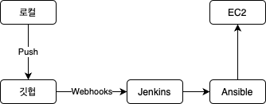

# 갈매기 마당

- 야구를 주제로 하는 간단한 게시판입니다.
- 야구팬으로서 야구를 좋아하는 사람들이 흥미로워할 게시판을 만들고 싶었습니다.
  
  
## 사용 기술

- Spring
  - Spring MVC
  - Spring Security
  - Spring Data Jpa
- Thymeleaf
- Mysql
- Memcached
   
  
## 프로젝트 링크

- https://zrr.kr/4dUG
  - id: test123
  - password: password123
  
  
  
  
# 프로젝트 소개
  

- 회원 관리
  - Spring Security를 사용하여 인증 등의 기능을 구현 했습니다.
    - 기본 필터를 사용하여 폼 로그인을 구현 했습니다.
    - 기본 필터를 사용하여 리멤버미 기능을 구현 했으며, 리멤버미 토큰은 DB에 저장 했습니다.
  
  
  
  

_태그 기능_
  
- 게시판
  - 포스트를 작성하고, 포스트에 코멘트를 남길 수 있는 기본적인 게시판을 구현 했습니다.
  - 야구가 주제인만큼 야구 선수 이름을 태그할 수 있는 기능을 만들었습니다.
    - 태그는 선수의 이름을 대괄호로 감싸는 것으로 이뤄집니다.
    - 태그된 선수 이름을 클릭하면 팝오버로 해당 선수의 간단한 성적을 보여줍니다.
  
  
  
  

_경기 일정-01_
  

_경기 일정-02_
  
- 경기 일정
  - 오늘의 경기 일정을 보여줍니다.
    - 날씨가 일정에 영향을 미치기 때문에, 오늘 경기가 예고된 경기장의 날씨를 함께 보여줍니다.
    - 승자 예측과 응원의 코멘트를 남길 수 있도록 했습니다.
  - 날씨는 외부 api를 통해 데이터를 받아오도록 했습니다.
    - 요청마다 api를 요청하면 너무 비효율적이라 캐싱 처리 했습니다.
    - 캐시 DB는 Memcached를 사용했습니다.
  
  
  
  

_예상 라인업-01_
  

_예상 라인업-02_
  
- 예상 라인업
  - 팬들의 투표를 기반으로한 예상 라인업을 제공합니다.
  - 투표를 바탕으로 적절한 라인업을 작성하여 시각적으로 보여줍니다.
  
  
  
  
## 배포 프로세스

- Docker, Jenkins, Ansible을 사용한 배포 자동화를 구현 했습니다.
  

_배포 자동화_

1. 로컬에서 깃헙으로 push를 합니다.
2. 깃헙 리포지토리에서 push가 발생하면 webhooks로 Jenkins에 알립니다.
3. Jenkins는 webhooks 요청을 감지하면, 정해진 빌드 프로세스를 시작합니다.
4. Ansible은 빌드 전처리를 합니다.
5. 도커 이미지 형태로 빌드되어 EC2에 배포됩니다.
  
  